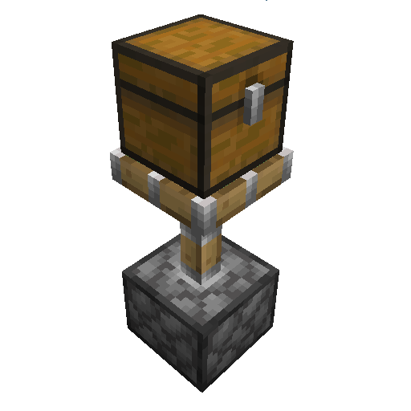

# Piston Command

Inspired by [Piston Control](https://www.curseforge.com/minecraft/mc-mods/piston-control)
from [the\_will\_bl](https://www.curseforge.com/members/the_will_bl/projects)

This mod gives you control over the way pistons move blocks with four new data pack tags:

* `pistoncommand:piston_behavior_normal` - pistons can push and pull the block like normal
* `pistoncommand:piston_behavior_block` - blocks pistons like obsidian or bedrock
* `pistoncommand:piston_behavior_destroy` - gets destroyed like beds and torches
* `pistoncommand:piston_behavior_push_only` - can be pushed but not pulled with a sticky piston, like glazed terracotta

Also lets you **move block entities** like chests and furnaces. You can turn this off in the mod config
(`Mods > Piston Command > Config`) or by setting `push_block_entities` to `false` in your server's
`config/pistoncommand-server.toml`. The default data pack makes campfires, banners and signs break to match Bedrock.

Works with **vanilla and Fabric clients** when installed on the server. We're trying to be compatible with as many other
mods as possible. If you notice any problems like blocks not updating or visual bugs
please [report them on GitHub](https://github.com/tancop/PistonCommand/issues).
